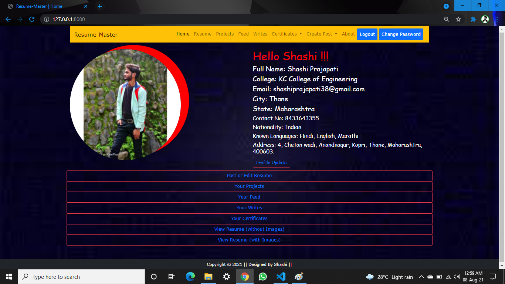

# Resume_master
Resume_master || Django || Python || MYSQL

Django Based Resume Building Project, Where Any user can build their Resume simply by creating their Account in the Website and Uploading their Educational Details and Certifications Completed.

 ====== ***Home Page*** =======

====== ***And this is the Final Resume*** =======  
Where You will get the option to see your resume with or without image as per your convenience (Resume will be comprises of all of your certifications, Projects & Other Achievements uploaded). It will Automatically render all of your details in the **Final Resume** page in a very beautiful way.

=== ***Post & Update Certificate*** =====

  
  

 

=== ***View Certificate*** =====  
You can see all of your Certificates Categorized by Platform (from where you Achieved) and Other Details and Just by Hovering over the image you can see Larger and Detailed of any Certificate

=== ***Like Dislike*** =====  
There Are Ever much more functionalities in the website where you can spend your time by Posting any of Your image, your Poems or anything you write and also see others Post and writes and Your will also get the option to **Like and Dislike** others Post.

==== ***Finally You will get the option to Download your Resume***  ====
  (Either with or without image as you need it).

  
***Thank You***

